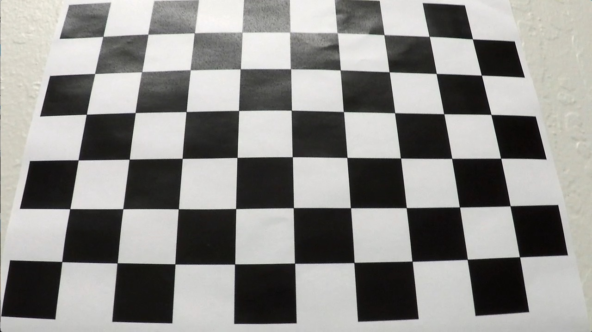
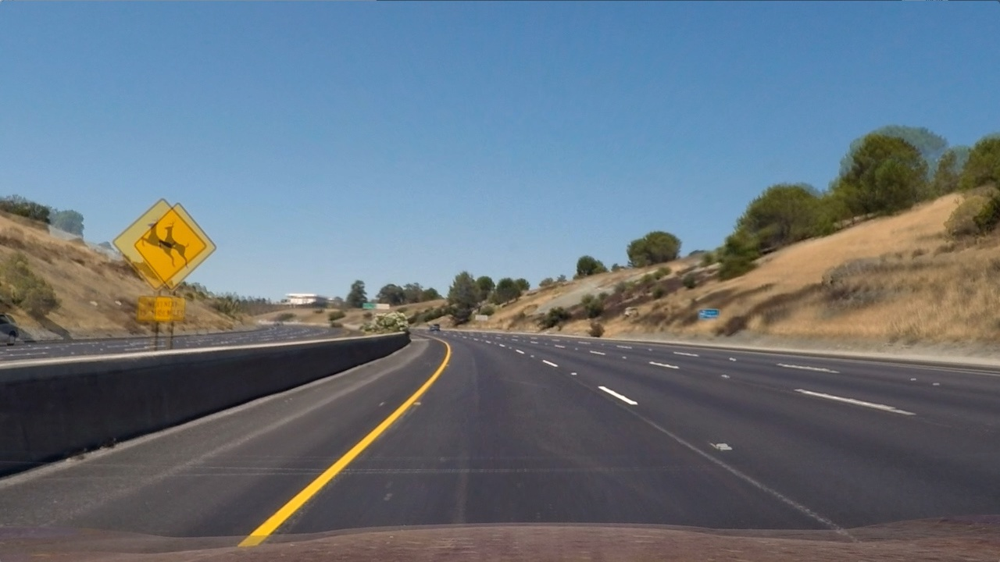
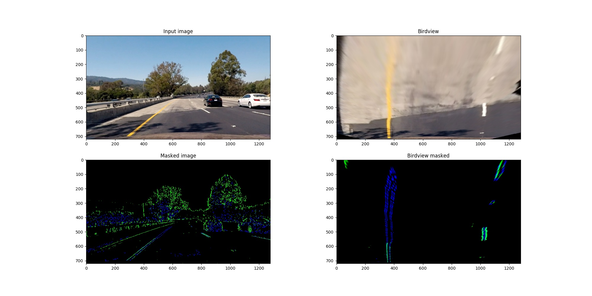
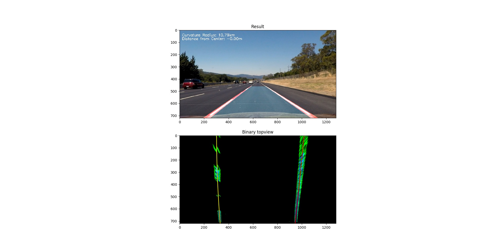

## Writeup for the CarND-Advanced-Lane-Lines project.

---

**Advanced Lane Finding Project**

The goals / steps of this project are the following:

* Compute the camera calibration matrix and distortion coefficients given a set of chessboard images.
* Apply a distortion correction to raw images.
* Use color transforms, gradients, etc., to create a thresholded binary image.
* Apply a perspective transform to rectify binary image ("birds-eye view").
* Detect lane pixels and fit to find the lane boundary.
* Determine the curvature of the lane and vehicle position with respect to center.
* Warp the detected lane boundaries back onto the original image.
* Output visual display of the lane boundaries and numerical estimation of lane curvature and vehicle position.

[//]: # (Image References)

[image1]: ./examples/undistort_output.png "Undistorted"
[image2]: ./test_images/test1.jpg "Road Transformed"
[image3]: ./examples/binary_combo_example.jpg "Binary Example"
[image4]: ./examples/warped_straight_lines.jpg "Warp Example"
[image5]: ./examples/color_fit_lines.jpg "Fit Visual"
[image6]: ./examples/example_output.jpg "Output"
[video1]: ./project_video.mp4 "Video"

## [Rubric](https://review.udacity.com/#!/rubrics/571/view) Points

### Here I will consider the rubric points individually and describe how I addressed each point in my implementation.  

---

### Writeup / README

### Camera Calibration

#### 1. This section describes how camera matrix and distortion coefficients were computed.

The code used for camera calibration in lines #17 through #112 of the file called `utils.py`) in the code folder "./code/".

I start by preparing "object points", which will be the (x, y, z) coordinates of the chessboard corners in the world. Here I am assuming the chessboard is fixed on the (x, y) plane at z=0, such that the object points are the same for each calibration image.  Thus, `objp` is just a replicated array of coordinates, and `objpoints` will be appended with a copy of it every time I successfully detect all chessboard corners in a test image.  `imgpoints` will be appended with the (x, y) pixel position of each of the corners in the image plane with each successful chessboard detection.  

I then used the output `objpoints` and `imgpoints` to compute the camera calibration and distortion coefficients using the `cv2.calibrateCamera()` function.  I applied this distortion correction to the test image using the `cv2.undistort()` function and obtained this result: 
Input image:


Result:


The calibration function is called within the initialization() step in `run.py` line #47. If camera calibration parameters are available already, they will be loaded. Otherwise, the camera will be calibrated.

### Pipeline (single images)

#### 1. Undistort image: 

The following image shows the effect of undistorting the image using the calibration data received in the previous step. In the following image both, the distorted and the undistored image, have been overlayed to visualize the effect of undistortion:


#### 2. Image masking

I used a combination of color/gradient thresholds and geometric masking to generate a binary image, which is implemented in lines #132 through #223 in `utils.py`).  In the following image, the effects of the different image masks can be observed. Green shows the effect of gradient masking using sobel x. Blue shows color masking. 
What can be observed in this particular plot is, why it is important to use both masking methods. Gradient thresholding shows good performance on the darker surface, but insufficient performance on the lighter surface due to the reduced contrast. Color masking compensates for that. However, color masking has issue with shadows thrown by trees for example. That is why I applied an additional gradient threshold on the color mask to reduce the effects of this downside.



#### 3. Perspective transform

The code for my perspective transform includes a function called `birdseye()`, which appears in lines #230 through #248 in the file `utils.py`.  This function takes as inputs an image (`img`), as well as source (`src`) and destination (`dst`) points as inputs. As the name suggests, it performs a perspective transform from vehicle camera perpective to birdview perspective. The function can be also used vice versa for backtransformation after lanes have been identified. The following values for source and destination points have been used:

```python
src = np.float32(
    [[(img_size[0] / 2) - 55, img_size[1] / 2 + 100],
    [((img_size[0] / 6) - 10), img_size[1]],
    [(img_size[0] * 5 / 6) + 60, img_size[1]],
    [(img_size[0] / 2 + 55), img_size[1] / 2 + 100]])
dst = np.float32(
    [[(img_size[0] / 4), 0],
    [(img_size[0] / 4), img_size[1]],
    [(img_size[0] * 3 / 4), img_size[1]],
    [(img_size[0] * 3 / 4), 0]])
```

This resulted in the following source and destination points:

| Source        | Destination   | 
|:-------------:|:-------------:| 
| 585, 460      | 320, 0        | 
| 203, 720      | 320, 720      |
| 1127, 720     | 960, 720      |
| 695, 460      | 960, 0        |

#### 4. Finding lanes

Then I did some other stuff and fit my lane lines with a 2nd order polynomial kinda like this:



#### 5. Describe how (and identify where in your code) you calculated the radius of curvature of the lane and the position of the vehicle with respect to center.

I did this in lines # through # in my code in `my_other_file.py`

#### 6. Provide an example image of your result plotted back down onto the road such that the lane area is identified clearly.

I implemented this step in lines # through # in my code in `yet_another_file.py` in the function `map_lane()`.  Here is an example of my result on a test image:

![alt text][image6]

---

### Pipeline (video)

#### 1. Provide a link to your final video output.  Your pipeline should perform reasonably well on the entire project video (wobbly lines are ok but no catastrophic failures that would cause the car to drive off the road!).

Here's a [link to my video result](./project_video.mp4)

---

### Discussion

#### 1. Briefly discuss any problems / issues you faced in your implementation of this project.  Where will your pipeline likely fail?  What could you do to make it more robust?

Here I'll talk about the approach I took, what techniques I used, what worked and why, where the pipeline might fail and how I might improve it if I were going to pursue this project further.  
