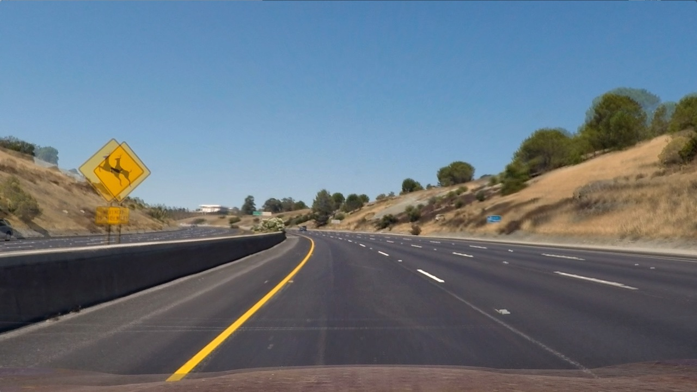
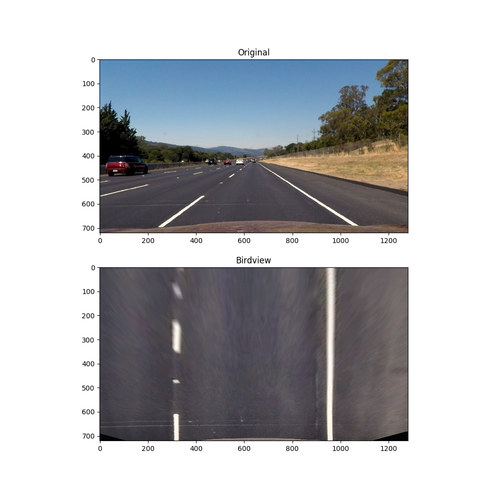
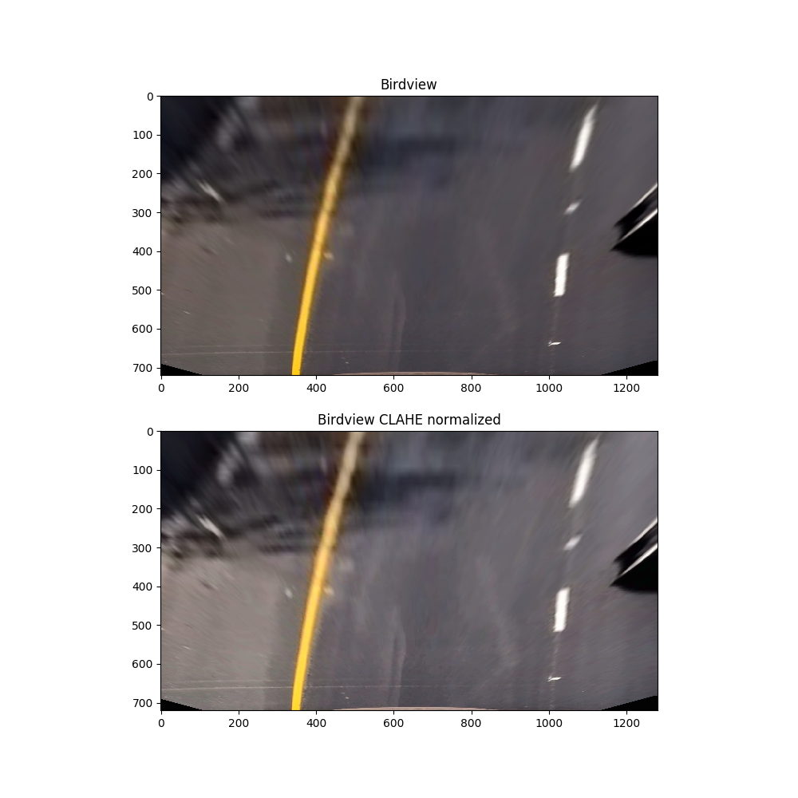
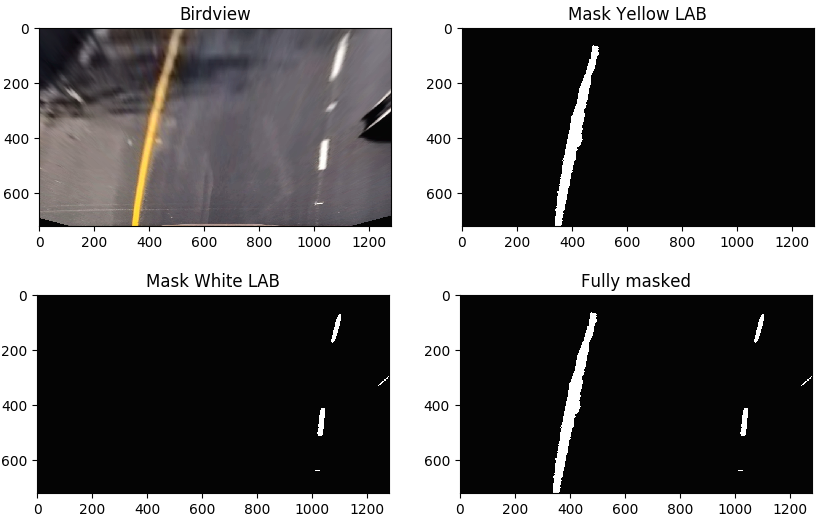
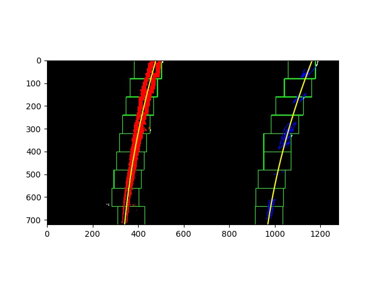
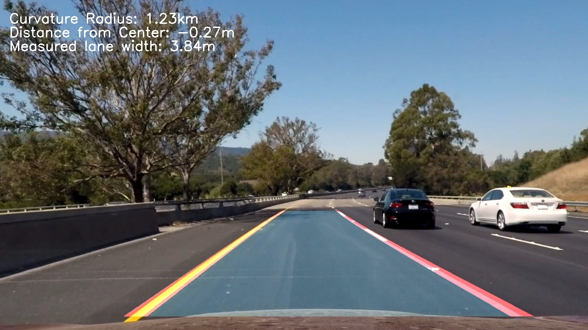

## Writeup for the CarND-Advanced-Lane-Lines project.

---

**Advanced Lane Finding Project**

The goals / steps of this project are the following:

* Compute the camera calibration matrix and distortion coefficients given a set of chessboard images.
* Apply a distortion correction to raw images.
* Use color transforms, gradients, etc., to create a thresholded binary image.
* Apply a perspective transform to rectify binary image ("birds-eye view").
* Detect lane pixels and fit to find the lane boundary.
* Determine the curvature of the lane and vehicle position with respect to center.
* Warp the detected lane boundaries back onto the original image.
* Output visual display of the lane boundaries and numerical estimation of lane curvature and vehicle position.

## [Rubric](https://review.udacity.com/#!/rubrics/571/view) Points

### Here I will consider the rubric points individually and describe how I addressed each point in my implementation.  

---

### Writeup / README

### Camera Calibration

#### 1. This section describes how camera matrix and distortion coefficients were computed.

The code used for camera calibration in lines #17 through #112 of the file called `utils.py`) in the code folder "./code/".

I start by preparing "object points", which will be the (x, y, z) coordinates of the chessboard corners in the world. Here I am assuming the chessboard is fixed on the (x, y) plane at z=0, such that the object points are the same for each calibration image.  Thus, `objp` is just a replicated array of coordinates, and `objpoints` will be appended with a copy of it every time I successfully detect all chessboard corners in a test image.  `imgpoints` will be appended with the (x, y) pixel position of each of the corners in the image plane with each successful chessboard detection.  

I then used the output `objpoints` and `imgpoints` to compute the camera calibration and distortion coefficients using the `cv2.calibrateCamera()` function.  I applied this distortion correction to the test image using the `cv2.undistort()` function and obtained this result: 
Input image:


Result:


The calibration function is called within the initialization() step in `run.py` line #47. If camera calibration parameters are available already, they will be loaded. Otherwise, the camera will be calibrated.

### Pipeline (single images)

#### 1. Undistort image: 

The following image shows the effect of undistorting the image using the calibration data received in the previous step. In the following image both, the distorted and the undistored image, have been overlayed to visualize the effect of undistortion:


#### 2. Perspective transform

I decided to make the perspective transform step before the image masking step, since I am only interested in the transformed image for detecting the lanes. By doing so, I am implicitly applying a geometric mask and can focus on the region of interest for the tuning of the image masks.  
The code for my perspective transform includes a function called `birdseye()`, which is located in lines #158 through #176 in `utils.py`.  This function takes the undistorted image (`img`) as an input, as well as source (`src`) and destination (`dst`) points. As the name suggests, it performs a perspective transform from vehicle camera perpective to birdview perspective. The function can be also used vice versa for backtransformation after lanes have been identified. I manually extracted the most suitable values for source points from the test_image `straight_lines2.jpg`, which appeared to show the straightest lines. The destination points I computed from the image size:

```python
dst = np.float32(
    [[(img_size[0] / 4), 0],
    [(img_size[0] / 4), img_size[1]],
    [(img_size[0] * 3 / 4), img_size[1]],
    [(img_size[0] * 3 / 4), 0]])
```

This resulted in the following source and destination points:

| Source        | Destination   | 
|:-------------:|:-------------:| 
| 580, 460      | 320, 0        | 
| 260, 691      | 320, 720      |
| 1067, 691     | 960, 720      |
| 705, 460      | 960, 0        |

The result of the perspective transform looks as follows:

  

#### 3. Image masking

For image masking I took a 2-step process including: 
  
    1. CLAHE normalization  
    2. Color masking  
  
The results using these two steps were sufficiently enough, so that I didn't apply any further masking techniques, such as gradient or geometric masking.  
  
**CLAHE Normalization**  (lines #22 through #34 of `masks.py`)  
The CLAHE normalization step helps to minimize the effects from different lightning conditions. Its main purpose for my pipeline is to minimize the impact of shadows from trees on the lane detection quality. Since I'll be using the LAB color space later on, I also applied the normalization in LAB color space. The effect of the normalization can be seend in the following image:  




The CLAHE method is described here:  

[CLAHE - Contrast Limited Adaptive Histogram Equalization] (https://docs.opencv.org/3.1.0/d5/daf/tutorial_py_histogram_equalization.html)

**Color masking**  (lines #22 through #34 of `masks.py`)  
For color masking I found that the LAB color space is most suitable for the white and yellow lane detection. I implemented two seperate masks, one for yellow line detection `def yellow_LAB()` and the other for white line detection `def white_LAB()`. The methodology for both lane types is the same: Convert image to LAB color space, apply upper and lower thresholds to all color channels respectively and combine them into one binary image. The only difference is, that I tuned the threshold differently for white and yellow lane detection. The results of this step can be seen in the following image:  



#### 4. Finding lanes

The masked binary image in birdview perspective builds the basis for the lane finding algorithm. Again, a 2-step process was sufficient to yield a satisfying result:
  
1. Apply search method  
    Prio 1: Use local search method (if lanes have been detected in the previous frame)  
    Prio 2: Use histogram search method (ff no lanes have been detected in previous frame)  
2. Apply gamma filter to lane coefficients 
     
**Histogram search** (`hist_search()`in lines #93 through #171 in `lanes.py`)  
The histogram search approaches the lane finding problem by dividing the binary image into 9 horizontal slices. For each slice, an histogram in vertical direction is computed, which basically the sum of pixels with value 1 for each column in the image slice. This method starts with the slice on the lower part of the picture and works upwards. Thus, it can be improved by applying a geometric mask before the search. Since we know that the car is driving more or less centerd in the lane and that the lane width can be assummed to be constant, we know quite precisely where we can expect lanes to be detected in the lower part of the image. Hence, we can apply a geometric mask around that area to improve the histogram search.

  

**Local search** (`local_search()` in lines #173 through #213 in `lanes.py`)  
The local search method uses the information from the previous time step(s), if lanes had been detected before. It applies a margin around the previously detected lanes (yellow lanes in the image above) and searches only in this area locally for "hot pixels".

**Gamma filter** (`filter_lanes()` in lines #297 through #318 in `lanes.py`)  
The gamma filter is a simple filter, weighing the current `measurement` and the measurement from the previous time steps (`history`), using the formula below. This is applied to all lane coefficients (3 polynom coefficients and estimated curvature radius) seperately. I tuned the filter with a value of `gamma = 0.6`.  
```python
gamma_filter = measurement * gamma + (1-gamma) * history
```
#### 5. Radius of curvature & lane center position

`get_radius()`:  
The calculation of the curvature radius is done in lines #56 through #72 in `lanes.py`. As said, in the previous section, the result is smoothened by applying a gamma filter.  
`get_lateral_position()`:  
The calculation of the lane center position is done in lines #34 through #54 in `lanes.py` and assumes the camera to be installed in the center of the car (vehicle center = image center). The current lateral position is calculated by computing the average lateral position in the lower part of the picture considering an area of 100 pixels height. From there, the distance to the image center can be computed. The [standard ego vehicle coordinate system](https://raw.githubusercontent.com/MechLabEngineering/TinkerforgeAttitude/master/Fahrzeug-Koordinatensystem-DIN70000.png) is applied, thus, positive values pointing to the left.

`Distance from Center > 0: ego vehicle driving right from lane center`  
`Distance from Center < 0: ego vehicle driving left from lane center`  

#### 6. Pipeline output 
Function: `plot_lanes()`in lines #299 through #360 in `utils.py`)  

Using the outputs from step 4 and 5 above, the lanes, curvature radius and lateral position can be plotted on the original image. To do this, the binary image with lanes drawn on it has to be back-transformed to the original perspective. This can be easily done be using the inverted `birdview()` function (lines #158 through #176) using the source points as destination points, which have been defined in section 2. The output of this step can be seen in the following image:

  

---

### Pipeline (video)

Here's a [link to my video result](https://youtu.be/i-v_CYDYmBc)  

`Distance from Center > 0: ego vehicle driving right from lane center`  
`Distance from Center < 0: ego vehicle driving left from lane center`  

---

### Discussion

#### 1. Briefly discuss any problems / issues you faced in your implementation of this project.  Where will your pipeline likely fail?  What could you do to make it more robust?

I had issues dealing with effects of shadow. As discussed previously, I mainly used the CLAHE normalization for reducing the effects of different lightning conditions. To make the lane detection more robust at varying lightning conditions, one could think of a dynamic masking technique, which will adapt the masking on the current scene (surfaces, shadows, light, etc.).   
Furthermore, for filtering I just used a simple gamma filter. Better results could be achieved with a kalman filter, for which, however different sensor sources would be required, such as gyrometer or wheel speed sensors for ego motion capture.
